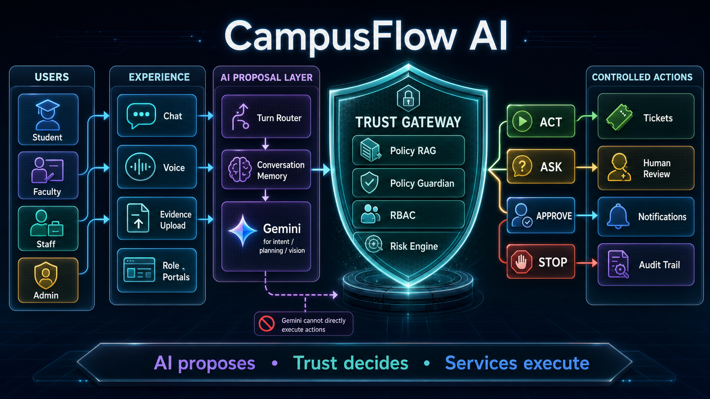

# CampusFlow AI

**AI that knows when to ACT, ASK, APPROVE or STOP.**

CampusFlow is a policy-grounded institutional service agent. Natural-language requests are interpreted as proposals only; deterministic policy, permission, risk and evidence controls decide whether any action is allowed.

## MVP workflows

- Maintenance complaint → **ACT** (creates a service ticket)
- Lab/room booking → **ASK** (requires user confirmation)
- Bonafide certificate → **APPROVE** (routes to an authorized approver)
- Unsafe or policy-conflicting request → **STOP** (no action is executed)

## Quick start

```bash
# Terminal 1
cd backend
python -m venv .venv
.venv\\Scripts\\activate
pip install -r requirements.txt
uvicorn app.main:app --reload

# Terminal 2
cd frontend
npm install
npm run dev
```

The demo uses an in-memory repository so it works without credentials. Set `VITE_API_URL` when deploying the frontend. See `.env.example` for optional production integrations.

## Tests

```bash
cd backend
pytest
```

## Architecture



`User → interpretation → policy guardian → RBAC → risk engine → autonomy engine → controlled tool → audit`

The LLM integration is deliberately not required for the demo: intent extraction has a transparent deterministic fallback. Add Gemini only as a proposal-generation adapter; it must never execute tools directly.

See the [hackathon architecture and agent-flow diagrams](docs/architecture.md) and the [demo script](docs/demo-script.md).
