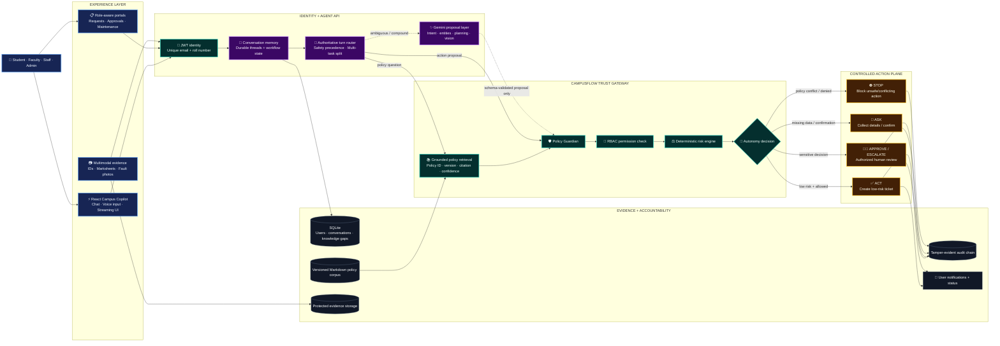
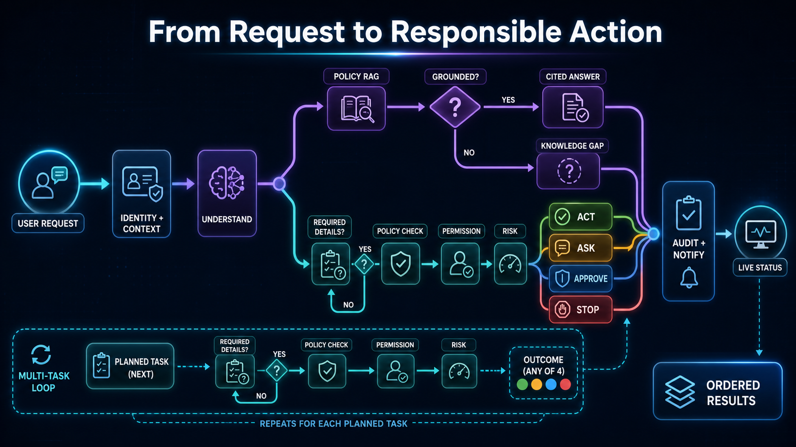
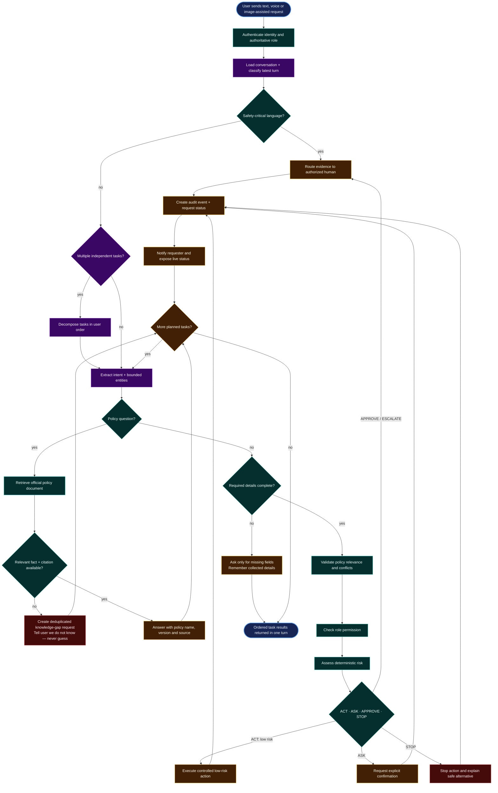
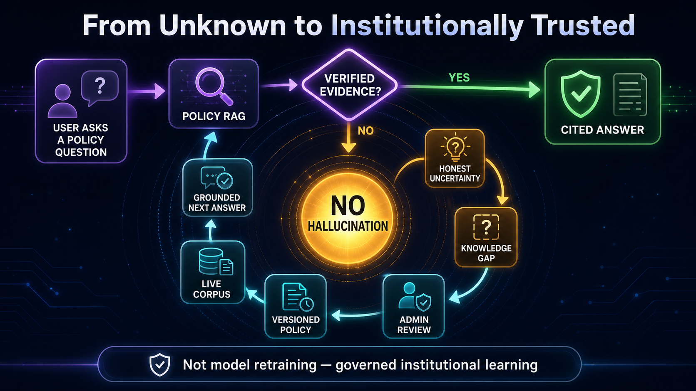

# CampusFlow AI — Hackathon Architecture

> **Pitch:** One campus copilot for services, policy and safety — with an AI brain for understanding and a deterministic control plane for trust.

CampusFlow does not give an LLM direct access to institutional actions. Gemini may understand, decompose and extract; every action must still cross policy, identity, permission, risk, evidence and confirmation gates. The result is an agent that acts quickly on low-risk work while escalating sensitive decisions to accountable humans.

## 1. System architecture — the Trust Gateway


_Presentation asset: [download the full-resolution PNG](images/campusflow-trust-gateway.png). The editable Mermaid version follows._



### The design principle

```text
Gemini can PROPOSE  →  Trust Gateway must DECIDE  →  Controlled services may EXECUTE
```

This boundary is the main differentiator. Prompt injection, hallucination or a model error cannot directly bypass role permissions or invoke a protected action.

## 2. End-to-end agent flow — understand, govern, act, prove



_Presentation asset: [download the full-resolution PNG](images/campusflow-agent-flow.png). The editable Mermaid version follows._



### Multi-task example judges can see complete in one turn

```text
User: “Tell me the hostel policy and report the broken AC in LH-123, ground floor.”

1. POLICY      → Retrieve → answer with citation
2. MAINTENANCE → Validate required fields → LOW risk → ACT → ticket created
3. RESULT      → Cited policy answer + ticket ID/status returned + notification sent
```

Low-risk work is not delayed by unnecessary approval. Only missing information, user-controlled bookings and sensitive/high-impact outcomes introduce a pause.

## 3. Knowledge flywheel — uncertainty becomes governed improvement



_Presentation asset: [download the full-resolution PNG](images/campusflow-knowledge-flywheel.png). The editable Mermaid version follows._

```mermaid
flowchart LR
    Q["❓ User asks an uncovered policy question"]
    SEARCH["🔎 RAG search + exact-fact grounding check"]
    KNOW{"Sufficient verified evidence?"}
    SAFE["🤝 Honest uncertainty response"]
    TICKET["🎫 Deduplicated knowledge-gap request"]
    ADMIN["👩‍💼 Admin reviews demand and uploads policy"]
    VALIDATE["🛡️ Validate file, metadata and policy ID"]
    INDEX["📚 Add versioned document to live corpus"]
    RESOLVE["✅ Resolve knowledge gap"]
    NEXT["💡 Next user gets a grounded cited answer"]
    ANSWER["📖 Immediate cited answer"]

    Q --> SEARCH --> KNOW
    KNOW -->|yes| ANSWER
    KNOW -->|no| SAFE --> TICKET --> ADMIN --> VALIDATE --> INDEX --> RESOLVE --> NEXT

    classDef query fill:#172554,stroke:#60a5fa,color:#eff6ff;
    classDef trust fill:#042f2e,stroke:#2dd4bf,color:#f0fdfa;
    classDef improve fill:#3b0764,stroke:#c084fc,color:#faf5ff;
    class Q,ANSWER,NEXT query;
    class SEARCH,KNOW,SAFE,VALIDATE trust;
    class TICKET,ADMIN,INDEX,RESOLVE improve;
```



This is not model retraining. It is a controlled institutional learning loop: the assistant admits uncertainty, creates visible demand for missing knowledge, and becomes more useful only after an authorized administrator supplies a verified source.

## Decision matrix

| Scenario | Risk | Agent mode | Human involvement | User-visible proof |
| --- | --- | --- | --- | --- |
| Broken AC with complete location | Low | **ACT** | Not required to create | Ticket ID, `OPEN` status, optional photo |
| Library/lab booking | Medium | **ASK** | User confirms selection | Booking reference + audit trace |
| Certificate request | Medium | **APPROVE** | Academic admin issues it | Verification report + approval status |
| Harassment/ragging/safety report | High | **ESCALATE** | Authorized officer reviews | Confidential grievance reference |
| Conflicting or unauthorized action | Any | **STOP** | Depends on policy | Reason + safe alternative |
| Missing policy fact | Unknown | **KNOWLEDGE GAP** | Admin publishes source | Gap ID, later cited answer |

## Real implementation map

| Layer | Main implementation |
| --- | --- |
| UI and streaming chat | `frontend/src/main.jsx` |
| Authentication and role identity | `backend/app/auth/`, `backend/app/api/auth_routes.py` |
| Authoritative routing | `backend/app/agents/router.py` |
| Gemini proposal/vision adapter | `backend/app/agents/gemini_adapter.py`, `document_verification_service.py` |
| Policy retrieval | `backend/app/rag/retriever.py`, `backend/app/rag/documents/` |
| Governance gates | `backend/app/policies/`, `permissions/`, `risk/`, `autonomy/` |
| Controlled workflows | `backend/app/services/request_service.py`, `backend/app/api/routes.py` |
| Evidence, status and accountability | maintenance attachments, notifications and audit services |

## 20-second closing line

> “Most copilots stop at answers. CampusFlow closes the institutional loop: it understands the request, proves the policy, chooses the permitted autonomy level, performs the action, and leaves a status and audit trail humans can trust.”
